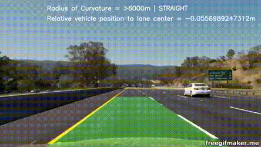
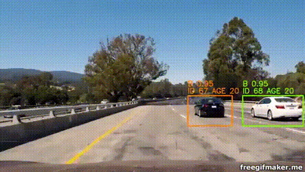

# SDC - Computer Vision and Deep Learning Projects

Computer Vision and Deep Learning related projects of Udacity's Self-driving Car Nanodegree Program:  
* [Lane Detection](./LaneDetection/)
* [Camera-based Vehicle Tracking](./CameraBasedVehicleTracking/)
* [Traffic Sign Classification](./TrafficSignClassification/)
* [Behavioral Cloning](./BehavioralCloning/)
* [Object Detection with SSD](./ObjectDetection/)
* [Semantic Segmentation](./SemanticSegmentation/)

## Lane Detection

  

## Camera-based Vehicle Tracking

  

## Traffic Sign Classification

  

## Behavioral Cloning

  

## Object Detection with SSD

  

## Semantic Segmentation

Coming soon..  
